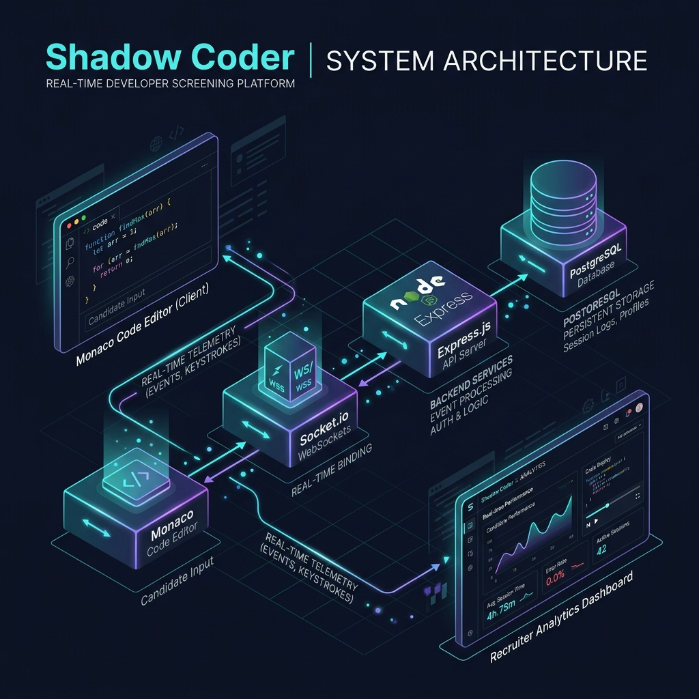

#  Shadow Coder

**Shadow Coder** is a next-generation technical interview and developer evaluation platform. By recording and analyzing every single keystroke, run, and compilation during a candidate's coding session, it provides recruiters with high-fidelity playback, paste-event detection, and deep metric insights—allowing you to evaluate developer capability and problem-solving flow far beyond just the final code output.

---

<p align="center">
  
  
  
  
  
  
</p>

---

## 🎨 System Architecture & Workflow

<p align="center">
  
</p>


---

## 🚀 Core Capabilities

### 💻 Developer Experience (Candidate IDE)
- **Monaco Code Editor**: Premium code editor workspace (built on VS Code) featuring smart syntax checking, auto-completion, bracket-matching, and dark mode theme.
- **Multiple Languages**: Supports full compile/run testing in Python, JavaScript, Java, C++, Go, and Rust.
- **Online Playground**: Test code dynamically with a custom input console (`stdin`) and automated test runner outputs.
- **Resilient Timers**: Robust, server-synced timer limits with auto-saving and automatic final submissions.

### 📊 Recruiter Analytics Panel
- **Keystroke Playback Player**: Standardized scrubber controls to play, pause, and speed up the live typing sequence of the candidate to review exact problem-solving habits.
- **Cheat & Paste Detection**: Clearly highlights pasting incidents, timing anomalies, and long periods of inactivity in the timeline.
- **Time Phase Breakdown**: Recharts-powered stack bar charts visualizing planning time (pre-coding), active writing, and code refactoring/debugging.
- **Candidate Head-to-Head**: Select and compare multiple candidates based on compile attempts, total test pass rate, total keys pressed, and timing logs.
- **Admin Evaluations**: Direct interface to append scoring metrics and persistent review notes onto candidates' session profiles.

### ✉️ Invites Workflow
- **Single Invites**: Easily configure and trigger unique candidate session URLs containing custom limits and specific programming tasks.

---

## 📂 Project Directory Structure

```text
├── app/                  # Next.js App Router (pages and layouts)
│   ├── dashboard/        # Recruiter Dashboard View
│   ├── interview/        # Candidate Live Coding IDE
│   ├── session/          # Session playback player and analytics
│   ├── compare/          # Candidate head-to-head metrics
│   └── globals.css       # TailwindCSS global stylesheet
├── src/
│   ├── views/            # Layout view components (Dashboard, SessionReview, auth, etc.)
│   ├── components/       # Reusable React components (Charts, Monaco wrapper, Countdown)
│   ├── routes/           # Express API endpoints (invites, auth, sessions, execute)
│   ├── middleware/       # JWT auth guards, rate limiters, validation
│   ├── services/         # Mailer SMTP, sandbox execute service, DB adapters
│   └── db/               # PostgreSQL schema & connection pool
├── public/               # Static assets & brand resources (logo.png, icons)
└── server.js             # Combined Express API and Socket.io WebSocket server
```

---

## ⚙️ Getting Started

> [!NOTE]
> Ensure you have [Node.js (v18+)](https://nodejs.org/) and a running [PostgreSQL](https://www.postgresql.org/) database.

### 1. Clone and Install Dependencies
```bash
git clone https://github.com/rajarajendra1103/ShadowCoder.git
cd ShadowCoder
npm install
```

### 2. Configure Environment Variables
Create a `.env` file in the root directory and define the configuration values:
```env
PORT=4000
FRONTEND_URL=https://shadow-coder.vercel.app
JWT_SECRET=your_jwt_secret_key

# AWS Aurora/RDS PostgreSQL Config
PG_HOST=database-1.cluster-cklmwcss8o9c.us-east-1.rds.amazonaws.com
PG_PORT=5432
PG_DATABASE=postgres
PG_USER=postgres
PG_PASSWORD=your_db_password

# JDoodle API (Code Execution)
JDOODLE_CLIENT_ID=your_jdoodle_client_id
JDOODLE_CLIENT_SECRET=your_jdoodle_client_secret

# SMTP Config (Email Invites)
SMTP_HOST=smtp.resend.com
SMTP_PORT=587
SMTP_USER=resend
SMTP_PASS=your_smtp_password
SMTP_FROM=onboarding@resend.dev
```

### 3. Initialize Database Tables
Set up the tables, relations, and index triggers on your PostgreSQL instance:
```bash
node initDb.js
```

### 4. Run Development Servers
Launch both the Next.js frontend dev-server and the Express/Socket.io backend API concurrently:
```bash
npm run dev
```

- **Recruiter Dashboard**: [http://localhost:3000/dashboard](http://localhost:3000/dashboard)
- **Backend API Server**: [http://localhost:5000](http://localhost:5000)

---

## 🛡️ License

This project is licensed under the MIT License. See [LICENSE](LICENSE) for details.
